# Analysis of Real Estate Sales Data

 
## 1. Title and Author

<!-- - Analysis of Real Estate Sales Data -->
- Prepared for UMBC Data Science Master Degree Capstone by *Dr Chaojie (Jay) Wang*
- Author : *Sriharsha Nemalikonda*
- Link to the author's GitHub profile : https://github.com/nsriharsha04
- Link to the author's LinkedIn profile : https://www.linkedin.com/in/sriharsha-n/
- Link to PowerPoint presentation file : [Presentation.pptx](./Presentation.pptx)
- Link to YouTube video : https://www.youtube.com/watch?v=3Wzc2l1T_vE&ab_channel=SriharshaNemalikonda
    
## 2. Background

The project aims to analyze real estate sales data in Connecticut from 2001 to 2020 to gain insights into the real estate market trends, property types, and sales prices over the years.
Understanding the patterns and trends in real estate sales is essential for various stakeholders, including homebuyers, investors, and policymakers. It can help in making informed decisions regarding property investments, policy adjustments, and market predictions.

#### Research Questions:
1. How has the sales volume of different property types (residential, apartment, commercial, industrial, vacant land) evolved over the years?
2. What is the trend in the average sales price for each property type during this period?
3. Can we identify any seasonal patterns in real estate sales?
4. Is there a correlation between property assessments and actual sales prices?

## 3. Data 

Describe the datasets you are using to answer your research questions.

- Data sources - Office of Policy and Management [ https://portal.ct.gov/OPM/IGPP/Publications/Real-Estate-Sales-Listing ]
- Data size - 110.4 MB
- Data shape (997213 of rows and 14 columns)

- Data dictionary - Here each row in the dataset represents a single real estate sale transaction.

|   Column Name      | Data Type  | Definition                                                                                                                                      | Potential Values                                                                                                                                                             |
|-------------------|------------|--------------------------------------------------------------------------------------------------------------------------------------------------|------------------------------------------------------------------------------------------------------------------------------------------------------------------------------|
| Serial Number     | int64      | Unique identifier for each sale.                                                                                                                | [2020348, 20002, 200212, 200243, 200377]                                                                                                                                    |
| List Year         | int64      | The year of the real estate listing (grand list year).                                                                                         | [2020, 2001, 2002, 2003, 2004]                                                                                                                                              |
| Date Recorded     | object     | The date when the sale was recorded.                                                                                                            | [09/13/2021, 10/02/2020, 03/09/2021, 04/13/2021, 07/02/2021]                                                                                                                |
| Town              | object     | The town where the property is located.                                                                                                         | [Ansonia, Ashford, Avon, Berlin, Bethany]                                                                                                                                    |
| Address           | object     | The address of the property.                                                                                                                    | [230 WAKELEE AVE, 390 TURNPIKE RD, 5 CHESTNUT DRIVE, 111 NORTHINGTON DRIVE, 70 FAR HILLS DRIVE]                                                                             |
| Assessed Value    | float64    | The assessed value of the property.                                                                                                             | [150500.0, 253000.0, 130400.0, 619290.0, 862330.0]                                                                                                                           |
| Sale Amount       | float64    | The sales price of the property.                                                                                                                | [325000.0, 430000.0, 179900.0, 890000.0, 1447500.0]                                                                                                                          |
| Sales Ratio       | float64    | A ratio related to the assessed value and sale amount.                                                                                         | [0.463, 0.5883, 0.7248, 0.6958, 0.5957]                                                                                                                                     |
| Property Type     | object     | The type of property (residential, apartment, commercial, industrial, vacant land).                                                            | [Commercial, Residential, Vacant Land, nan, Apartments]                                                                                                                      |
| Residential Type  | object     | Specific type within residential properties (if applicable).                                                                                    | [nan, Single Family, Condo, Two Family, Three Family]                                                                                                                         |
| Non Use Code      | object     | Code related to the use of the property.                                                                                                        | [nan, 08 - Part Interest, 14 - Foreclosure, 25 - Other, 01 - Family]                                                                                                          |
| Assessor Remarks  | object     | Remarks from the assessor (if available).                                                                                                       | [nan, WATERFRONT/COTTAGE ONLY/LAND IS ASSOCIATION OWNED, FORECLOSURE SALE OUT OF BANK, DEFERRED MAINTENANCE, H16095]                                                        |
| OPM Remarks       | object     | Remarks from the Office of Policy and Management (if available).                                                                                 | [nan, GAS STATION, GOOD SALE PER MLS, RENOVATED ONE UNIT PER MLS - SEE PREVIOUS SALE #201127, PER MLS SALE IS FOR LAND - ASSESSMENT INCLUDES BUILDING]                 |
| Location          | object     | Additional location-related information (if available).                                                                                         | [nan, POINT (-73.18197 41.64672), POINT (-72.22025 41.3942), POINT (-72.24486 41.32183), POINT (-72.07229 41.32148)]                                                        |

- Which variable/column will be your target/label in your ML model? - *The "Sale Amount" will be the target/label variable for machine learning models. We may aim to predict this variable based on other features.*
- Which variables/columns may selected as features/predictors for your ML models? -
*Potential predictor variables could include "List Year," "Assessed Value," "Property Type," and other relevant columns that could influence property sales prices.*

 ## 4. Exploratory Data Analysis (EDA)

- Checked for null values in the columns
- Processed rows and removed STOP_WORDS

#### 4.3.1 Plot missing data

- Plotted the missing data plot. 

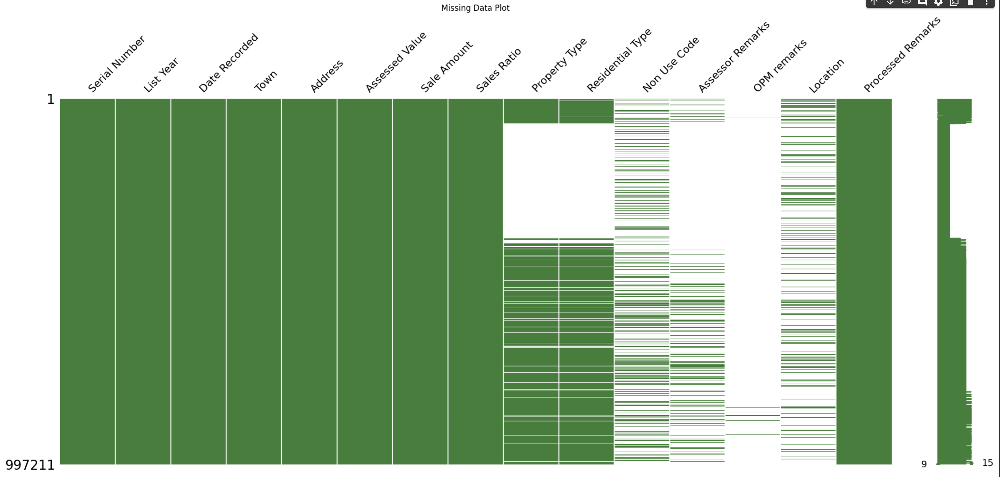
 - -  This missing data plot shows that OPM remarks columsn has more null values. 

#### 4.3.2 Assessed Value vs Sale Amount

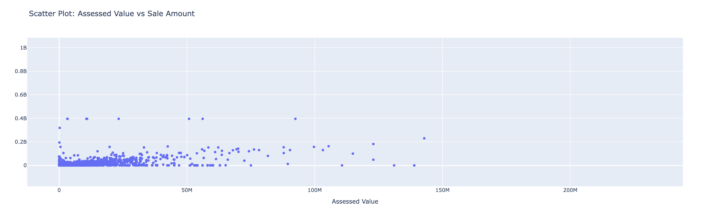
- - The sale amount almost coincides with the assesed values less than 40M.

#### 4.3.3 Number of Properties by Type

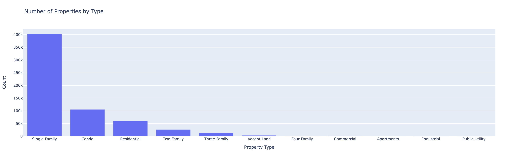
- - Most of the properties are owned by single family.

#### 4.3.4 Distribution of Residential Types

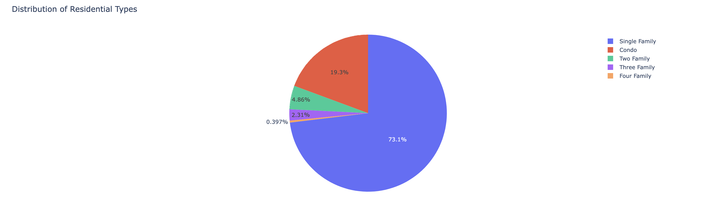
- - Single families have a share of 73.1% properties.

#### 4.3.5 Total Sales Amount Over Years

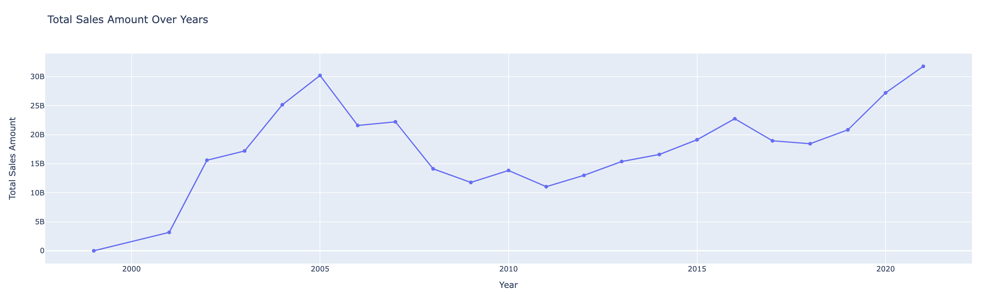
- - There has been sudden dips in properties sold in the year 2006 & 2008.

#### 4.3.6 Bar Chart for List Year

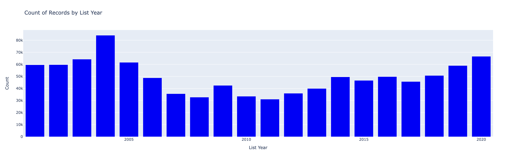
- - 2004 observed a increase in property sales.

#### 4.3.7 Histogram for Assessed Value

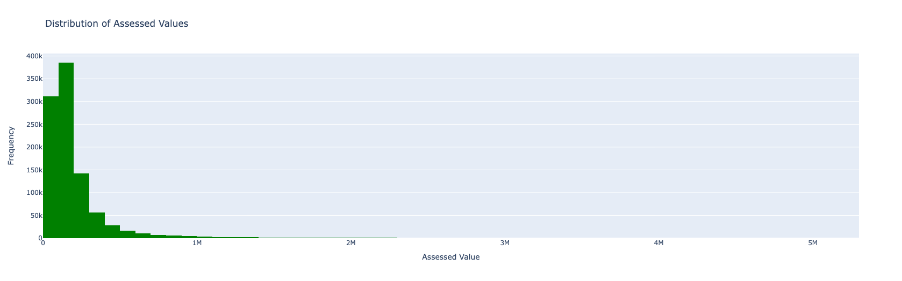
- - Most of the people bought the properties in the range of $100K to $200K.

#### 4.3.8 Time Series Plot for Date Recorded

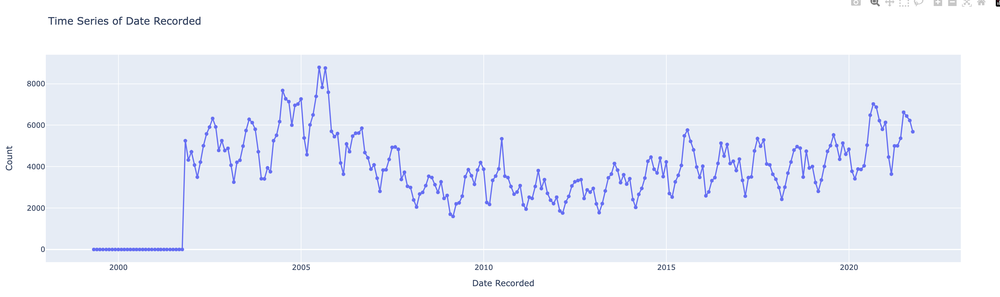
- - There has been an exponential increase of the properties bought between Feb 2005 to Aug 2005, followed by decline.

#### 4.3.9 Distribution of Assessed Values without Outliers

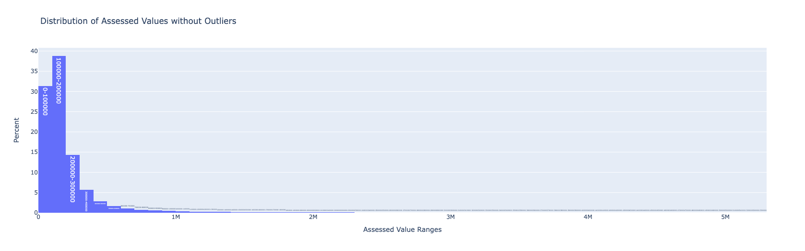
- - Higher the property assessed value lesser is that they are bought.

#### 4.3.10 Evolution of Sales Volume by Property Type

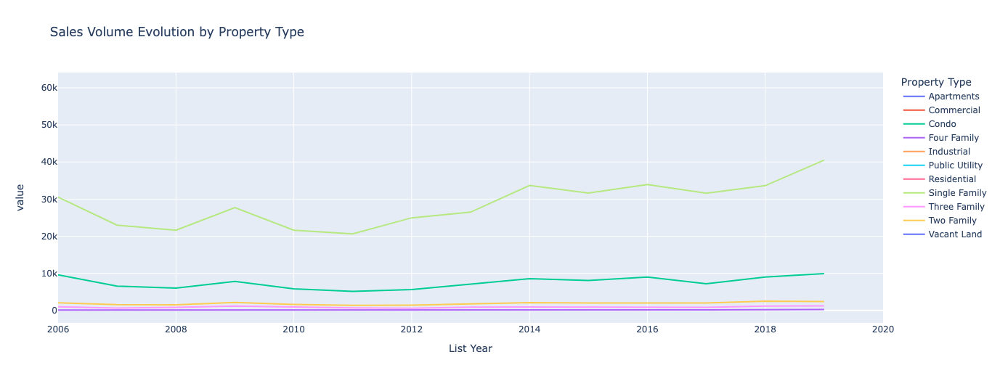
- - Single families own more properties.

#### 4.3.11 Trend in Average Sales Price by Property Type

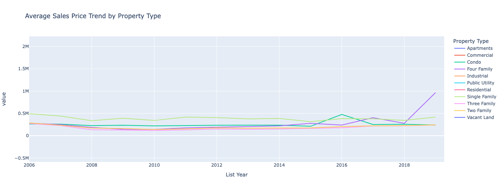
- - There has been increase in apartment sales.

#### 4.3.12 Identifying Seasonal Patterns in Real Estate Sales

- - There has been decrease in property sales after August.

#### 4.3.13 Correlation between Property Assessments and Sales Prices

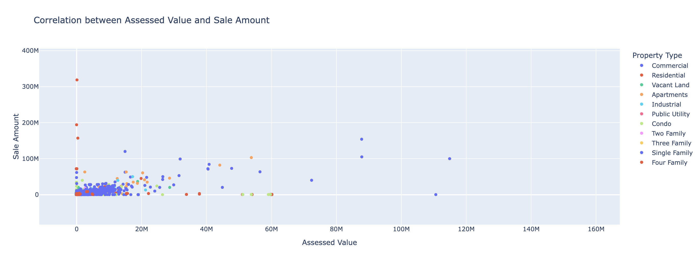
- - Most of the commercial properties have sale amount similiar to assesed value.

#### Interpretations
* There have been highest number of sales in 2004.
* Most of the property values are in the range of 100K to 200K
* Residential properties have a largest share with Single Family of 73% of all properties.
* The sale value is more than the assessed value.

<!--
- Perform data exploration using Jupyter Notebook
- You would focus on the target variable and the selected features and drop all other columns.
- produce summary statistics of key variables
- Create visualizations (I recommend using Plotly)
- Find out if the data require cleansing:
  - missing values?
  - duplicate rows? 
- Find out if the data require splitting, merging, pivoting, etc.
- Find out if you need to bring in other data sources to augment your data.
  - For example, population, socioeconomic data from Census may be helpful.
- For textual data, you will pre-process (normalize, remove stopwords, tokenize) them before you can analyze them in predictive analysis/machine learning.
- Make sure the resulting dataset need to be "tidy":
  - each row represent one observation (ideally one unique entity/subject).
  - each columm represents one unique property of that entity. 
-->

## 5. Model Training 

- Data is divided into training and testing (80/20) sets for model evaluation. 
- The ML models implemented are:
  - Linear Regression
  - Ridge Regression 
  - Gradient Boosting Regressor
- The performance is compare based on MAE scores.
- Features: 'List Year', 'Assessed Value', 'Sales Ratio', 'Property Type', 'Residential Type’
- Target: Sale Amount

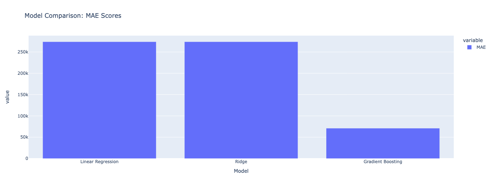

- The Gradient Boosting model shows a significantly lower MAE, suggesting improved predictive accuracy.

## 6. Web Application.

The web application is developed using StreamLit. This application contains 3 pages:

1. Data Exploration
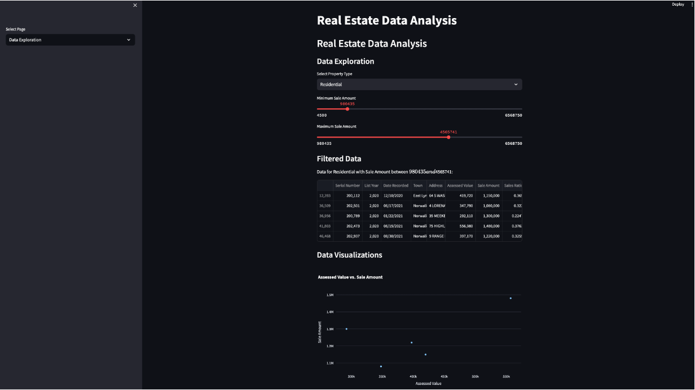
  - We can explore the dataset by selecting ‘Sale Amount’ range and ‘Property Type’
  - Plot corresponding dynamics

2. Dynamic Plotting
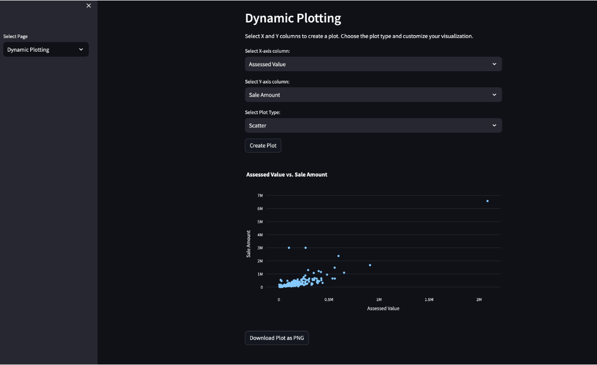
  - This page has the flexibility to plot dynamically by choosing the required column on the X & Y axis
  - Plot types like Scatter, Bar, Histogram, and line can be dynamically set.
  - The plot can be downloaded as PNG.

3. Unique Data
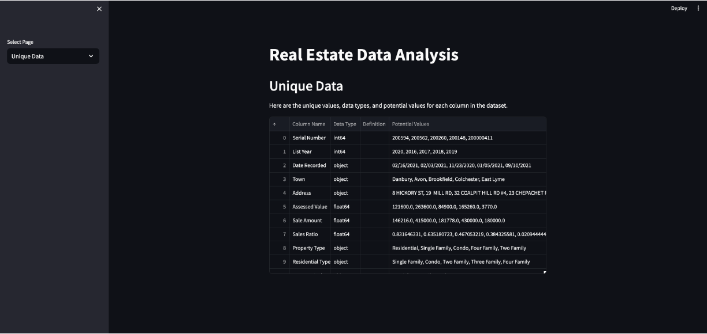
  - Display the unique values in each column
 

## 7. Conclusion

- In this project, I have worked on analyzing real estate sales data, building a Streamlit app for data exploration, and visualizing the data with interactive plots. 
- The potential applications of this work include assisting real estate professionals in gaining insights into property sales trends, understanding the distribution of property types, and exploring the relationships between different variables. 
- It can also be useful for property buyers and investors who want to make informed decisions based on historical data.

\
Limitations:
-  The analysis heavily relies on the quality of the data. Any missing or incorrect information can lead to inaccurate insights.

\
Lessons Learned:
-  Data preprocessing is a crucial step in any data analysis project. Handling missing data and outliers is essential for obtaining meaningful results.

\
Future Scope:
- Predictive Modeling: Developing machine learning models for property price prediction or anomaly detection to identify potential investment opportunities.
- Geospatial Analysis: Incorporating geospatial data to analyze property locations and their impact on prices.

## 8. References 

- Real Estate Sales 2001-2020 GL | Connecticut Data. (2022, October 20). https://data.ct.gov/Housing-and-Development/Real-Estate-Sales-2001-2020-GL/5mzw-sjtu

<!-- List articles, blogs, and websites that you have referenced or used in your project. -->